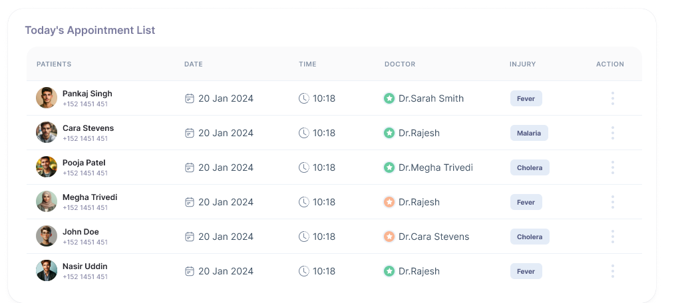

# screening-frontend
Repository for screening frontend Dev Candidates

As part of our evaluation, we would like to assess your development skills. Therefore, we have set up a short assessment to evaluate the candidate’s skills by converting a simple component to be implemented using React with Tailwind CSS.

We specifically request that you refrain from using AI or automated tools in your assessment. We value your personal insights and development skills in this evaluation.

We are interested in your perspective on the development. Your responses will play a crucial role in our evaluation process.

Looking forward to your response for the assessment on or before March 3, 2024. If you have any questions or concerns, please do not hesitate to reach out.

## Deliverables

After carefully evaluating the mockup, please create a React application that calls this mock JSON (https://gist.githubusercontent.com/telematum/7751eec667033ac8acd244542e464e18/raw/d4710c6fb54224a0bd316ecdc5246633aceefce5/todays.json) and display the data. Save time by not placing images; instead, use colored placeholders.

Once completed, please raise a PR in this repository with the source code and the built result (the 'dist' folder) as well. Ensure to mention your email and name in the PR, as that would allow us to relate your application with the PR
